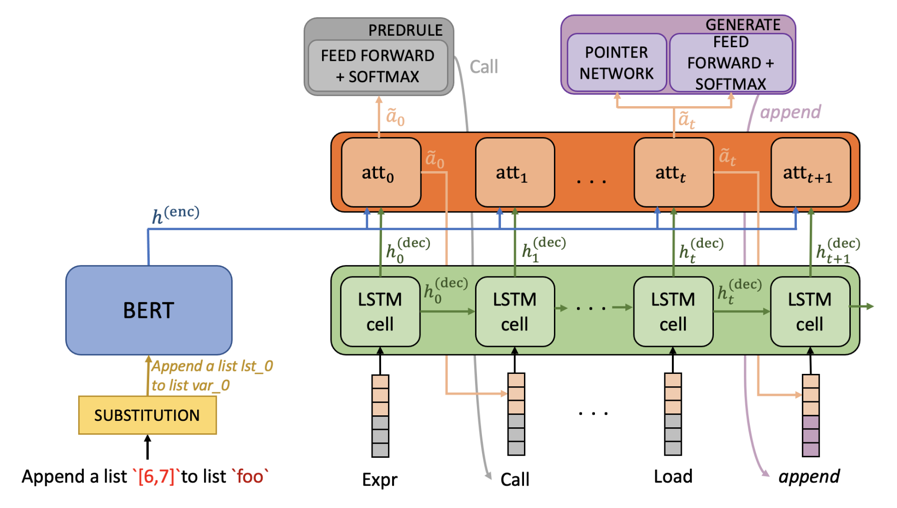

# BERTranX

We present an architecture based on **BERT** encoder and a general-purpose **Tran**sition-based abstract synta**X** parser
that maps natural language queries into Python code.

## System Architecture

For technical details please refer to our [Findings of ACL '22 paper](https://aclanthology.org/2022.findings-acl.173.pdf). 
As in [TranX architecture](https://arxiv.org/abs/1806.07832), we use abstract syntax trees (ASTs) defined in the 
Abstract Syntax Description Language (ASDL) as intermediate meaning
representation to generate code.



Figure 1 gives an overview of the system.


**File Structure**: 

```bash
├── asdl (contains grammar informations, AST operations and transition system)
├── components (vocabulary creation and class)
├── config (config files to change hyperparameters)
├── dataset (data sets and preprocessing)
├── model (PyTorch implementation of neural nets)
├── outputs (models parameters saved and results)
```

### Evaluation Results

Here is a list of performance results on data sets CoNaLa and Django, using pretrained models in `outputs/`:

| Dataset | BLEU results | Accuracy results |
| ------- |--------------|------------------|
| Django  | 79.86        | 79.77            |
| CoNaLa  | 34.20        | 5.8              |


## Usage


### TL;DR

```bash
git clone https://gitlab.com/codegenfactors/BertranX
cd BertranX
conda env create -f environment.yml  # create conda Python environment.

bash ./getdata.sh  # get datasets and pre-trained models

python main.py config/config.yml # Launch train/test depending on config.yml
```

## Reference

BertranX is described in the following paper:

```
@inproceedings{DBLP:conf/acl/BeauC22,
  author    = {Nathana{\"{e}}l Beau and
               Beno{\^{\i}}t Crabb{\'{e}}},
  title     = {The impact of lexical and grammatical processing on generating code
               from natural language},
  booktitle = {Findings of the Association for Computational Linguistics: {ACL} 2022,
               Dublin, Ireland, May 22-27, 2022},
  pages     = {2204--2214},
  publisher = {Association for Computational Linguistics},
  year      = {2022},
  url       = {https://aclanthology.org/2022.findings-acl.173},
}
```

## Thanks

We are also grateful to the following paper that inspire this work:
```
TRANX: A Transition-based Neural Abstract Syntax Parser for Semantic Parsing and Code Generation.
Pengcheng Yin and Graham Neubig.
In Conference on Empirical Methods in Natural Language Processing (EMNLP), 2018.
```
